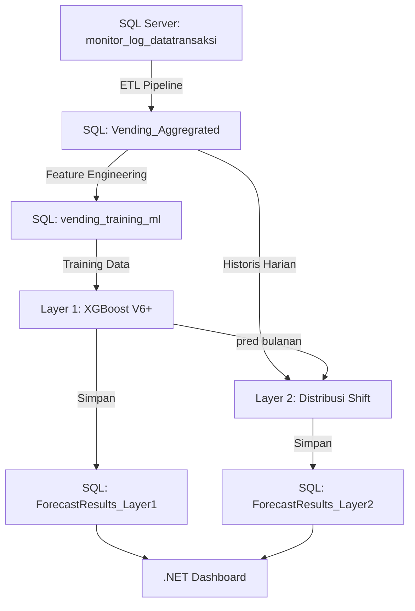

# 🏗️ Rencana Implementasi FastAPI — SQL-First Architecture

> Berdasarkan: [FastAPI_Integration_Plan.txt](file:///c:/Users/isyaa/OneDrive/Documents/Web%20and%20Code/vending_api/ProductionML/FastAPI_Integration_Plan.txt)

---

## Gambaran Besar Arsitektur



---

## ✅ Yang SUDAH Selesai

| No | Item | Status |
|---|---|---|
| 1 | Tabel `Vending_Aggregrated` | ✅ Sudah ada |
| 2 | Tabel `vending_training_ml` | ✅ Sudah ada |
| 3 | ETL Pipeline (`POST /etl/run-pipeline`) | ✅ Sudah jalan, 35.008 baris |
| 4 | Koneksi SQL Server (SQLAlchemy + pyodbc) | ✅ `database.py` |
| 5 | Model artifact (`Layer1_XGBoost_V6_Artifact.joblib`) | ✅ Sudah terlatih |

---

## 🔨 Yang PERLU Dieksekusi (Urutan Kerja)

### Fase 1: Persiapan Database (SQL Server)
> Membuat wadah tabel output yang belum ada

| Step | Aksi | Detail |
|---|---|---|
| **1A** | CREATE TABLE `ForecastResults_Layer1` | Tabel hasil prediksi bulanan + metrik evaluasi |
| **1B** | CREATE TABLE `ForecastResults_Layer2` | Tabel hasil distribusi harian × shift × varian |
| **1C** | Verifikasi tabel `OperationalCalendar` | Pastikan sudah ada dan terisi kalender 2026 |

### Fase 2: Refactor Script Python → SQL-Based
> Mengubah semua script agar membaca/menulis dari SQL, BUKAN CSV

| Step | File | Perubahan | Status |
|---|---|---|---|
| **2A** | `Script_Pipeline_Databuilder.py` | Data di-bridge via `etl_service.py` (SQL→CSV temp→proses→SQL) | ✅ Workaround |
| **2A+** | `Script_Pipeline_Databuilder.py` | **Conditional Ramadan Lag Skipper** (historis = natural, 2026+ = skip) | ✅ Selesai |
| **2B** | `Script_Model_XGBoost_V6_Fallback.py` | Di-wrap oleh `retrain_service.py` yang baca dari SQL | ✅ Selesai |
| **2C** | `Script_production_daily_2_prod_v2.py` | Via `forecast_service.py` sudah SQL-based | ✅ Selesai |

> [!IMPORTANT]
> **Layer1_Core.py TIDAK PERLU DIUBAH.** Class `Layer1Model` dan artifact `.joblib` tetap utuh.

### Fase 3: Bangun Endpoint FastAPI
> Membungkus semua script ke dalam API yang bisa dipanggil

| Step | Endpoint | Method | Fungsi | Status |
|---|---|---|---|---|
| **3A** | `/api/v1/forecast/generate` | POST | ⭐ **INTI UTAMA** — Jalankan Layer 1 + Layer 2, simpan ke SQL | ✅ |
| **3B** | `/api/v1/forecast/update-actuals` | POST | Bandingkan prediksi vs data aktual dari `Vending_Aggregrated` | ✅ (Layer1, Layer2 belum) |
| **3C** | `/api/v1/model/retrain` | POST | Retrain model XGBoost (BackgroundTasks) | ✅ Selesai |
| **3C+** | `/api/v1/model/retrain-status` | GET | Cek status retraining terakhir | ✅ Bonus |
| **3D** | `/api/v1/forecast/history` | GET | Lihat riwayat semua prediksi yang pernah dijalankan | ✅ |
| **3E** | `/etl/run-pipeline` | POST | ETL Pipeline | ✅ |

### Fase 4: Testing End-to-End
> Validasi bahwa semua pipeline berjalan benar

| Step | Test |
|---|---|
| **4A** | Generate prediksi April 2026 → hasil harus ~76K (bukan ~50K) |
| **4B** | Update aktual → cek ErrorPercent terisi di SQL |
| **4C** | Verifikasi di SQL Server bahwa semua tabel terisi |

---

## 🎯 Rekomendasi: Mulai Dari Mana?

### Urutan Eksekusi yang Direkomendasikan:

```
Step 1A → 1B → 1C    (Buat tabel SQL dulu)
         ↓
Step 2A → 2B → 2C    (Refactor script ke SQL-based)
         ↓
Step 3A               (Endpoint Generate — ini yang paling penting)
         ↓
Step 3B               (Endpoint Update Actuals)
         ↓
Step 3C → 3D          (Retrain + History)
         ↓
Step 4A → 4B → 4C    (Testing)
```

> [!TIP]
> **Step 1A dan 1B** adalah yang paling ringan dan cepat — hanya perlu menjalankan `CREATE TABLE` di SQL Server. Ini **harus duluan** karena semua endpoint bergantung pada keberadaan tabel-tabel ini.

---

## ⚠️ Aturan Kritis dari Blueprint

1. **JANGAN ubah logika ML.** Gunakan `Layer1Model` dari `Layer1_Core.py` apa adanya.
2. **SEMUA data source HARUS dari SQL** — tidak boleh ada CSV lagi.
3. **Gunakan BackgroundTasks** untuk proses Retraining (mencegah timeout API).
4. **Conditional Ramadan Lag Skipper WAJIB diimplementasi:**
   - Data historis (2023–2025): lag dihitung **natural** (shift biasa)
   - Data 2026+: lag **SKIP** bulan Ramadan
   - Jika tidak: prediksi April 2026 akan salah (~50K vs seharusnya ~76K)
